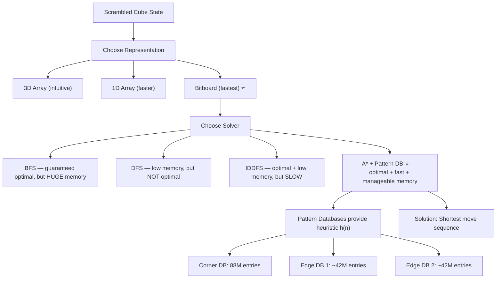
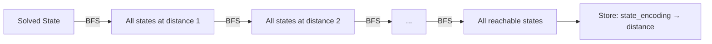

# Rubik's Cube Solver in C++ — Complete Deep Dive & Interview Guide

## 🎯 Project Overview

This project is an **optimal Rubik's Cube solver** written in C++17. "Optimal" means it finds the **shortest possible sequence of moves** to solve any scrambled cube. It does this by modeling the cube as a graph/state-space problem and using AI search algorithms (BFS, DFS, IDDFS, A*) combined with **Pattern Databases** as heuristics.

> [!IMPORTANT]
> This is NOT a layer-by-layer human solver. It treats the cube as a **state-space search problem** — every configuration of the cube is a "node" in a graph, and every move is an "edge". Solving = finding the shortest path from the scrambled state to the solved state.

---

## 📁 Complete File Structure

```
RubiksCubeSolver/
├── Models/
│   ├── Rubikscube.hpp          ← Abstract base class (interface)
│   ├── Rubikscube.cpp          ← Shared implementations (scramble, print, etc.)
│   ├── ThreeDArrayModel.cpp    ← 3D array representation [6][3][3]
│   ├── OneDArrayModel.cpp      ← 1D array representation [54]
│   └── BitBoardModel.cpp       ← Bitboard representation (64-bit ints) ⭐ FASTEST
├── Solvers/
│   ├── Bfs.hpp                 ← Breadth-First Search solver
│   ├── Dfs.hpp                 ← Depth-First Search solver (depth-limited)
│   ├── IDDfs.hpp               ← Iterative Deepening DFS solver
│   └── AStar.hpp               ← A* Search with Pattern DB heuristic ⭐ BEST
├── PatternDatabase/
│   ├── CornerDatabase/
│   │   └── CreateCornerDatabase.cpp
│   ├── EdgeDatabase/
│   │   └── CreateEdgeDatabase.cpp
│   ├── Database/               ← Where .pdb files are stored
│   └── FileManager.cpp         ← Read/write pattern DB to disk
├── Utils/
│   └── GenericRubiksHash.hpp   ← Custom hash function for unordered_map
├── main.cpp                    ← Entry point
└── CMakeLists.txt              ← Build system
```

---

## 🧠 The Big Picture: Why This Architecture?



---

## 📦 Component 1: The Cube Models (`/Models`)

### The Design Pattern: **Abstract Base Class + Polymorphism**

The project uses a classic **Strategy / Template Method pattern**:

- `Rubikscube.hpp` defines an **abstract base class** with:
  - Pure virtual functions for getting/setting face colors
  - Pure virtual functions for each of the 18 moves (6 faces × 3 rotations: clockwise, counter-clockwise, 180°)
  - Concrete (shared) methods like `scrambleCube()`, `isSolved()`, `print()`, `operator==`

- Three concrete classes implement this interface with different internal data structures

> [!TIP]
> **Interview Angle:** This is a textbook example of the **Open/Closed Principle** (SOLID). You can add a new representation without modifying the solvers. The solvers work with the abstract interface.

### Why 3 Representations?

| Model | Internal Storage | Memory per State | Move Speed | Use Case |
|-------|-----------------|------------------|------------|----------|
| **ThreeDArrayModel** | `char cube[6][3][3]` | ~54 bytes | Slowest | Learning/debugging, intuitive indexing |
| **OneDArrayModel** | `char cube[54]` | ~54 bytes | Medium | Better cache locality than 3D |
| **BitBoardModel** | `uint64_t` integers | ~48 bytes (6 × 8B) | **Fastest** ⭐ | Production solver — bitwise ops for moves |

### The 18 Moves

A standard 3×3 Rubik's Cube has **6 faces**: Up(U), Down(D), Left(L), Right(R), Front(F), Back(B).

Each face has **3 possible rotations**:
- **Clockwise (CW):** `U`, `D`, `L`, `R`, `F`, `B`
- **Counter-clockwise (CCW):** `U'`, `D'`, `L'`, `R'`, `F'`, `B'` (called "prime")
- **180° (double):** `U2`, `D2`, `L2`, `R2`, `F2`, `B2`

Total: **6 × 3 = 18 moves**. This is the "branching factor" of our search tree.

> [!IMPORTANT]
> **Interview Question:** "What is the branching factor of the Rubik's Cube search tree?"
> **Answer:** Technically 18, but with **move pruning** (don't reverse the last move, don't do the same face twice in a row), effective branching factor drops to ~13-15.

---

### Model 1: ThreeDArrayModel — `char cube[6][3][3]`

**How it works:**
- 6 faces, each is a 3×3 grid of characters (colors)
- Index: `cube[face][row][col]`
- Face 0 = Up, Face 1 = Down, etc.

**A clockwise rotation involves:**
1. **Rotate the face itself** (like rotating a 2D matrix 90° clockwise)
2. **Cycle the 4 adjacent edge strips** — e.g., rotating the Front face moves strips from Up, Right, Down, Left

**Tradeoff:**
- ✅ Very intuitive, easy to debug and visualize
- ❌ Slow — lots of array indexing, poor cache locality for moves that touch multiple faces
- ❌ Large comparison cost (comparing 54 elements)

---

### Model 2: OneDArrayModel — `char cube[54]`

**How it works:**
- Flatten the 6×3×3 array into a single 54-element array
- Index mapping: `face * 9 + row * 3 + col`

**Tradeoff:**
- ✅ Better cache locality (contiguous memory)
- ✅ Faster hashing (can hash a single contiguous block)
- ❌ Still character-level operations, no bitwise speedups

---

### Model 3: BitBoardModel — `uint64_t` integers ⭐

**How it works:**
- Each face color needs 3 bits (6 colors = values 0-5, fits in 3 bits)
- Each face has 9 stickers × 3 bits = 27 bits → fits in one `uint64_t` (64 bits)
- 6 faces × 1 `uint64_t` = 6 integers total
- Moves are implemented as **bit shifts and masks**

**Why this is brilliant:**
- A clockwise face rotation = **a specific sequence of bit shifts and masks** — no loops needed!
- Comparison of two states = comparing 6 integers (instead of 54 chars)
- Hashing = XOR/combine 6 integers

**Tradeoff:**
- ✅ **Blazing fast** — bitwise operations are the fastest operations a CPU can do
- ✅ Compact state representation
- ❌ Very hard to understand and debug
- ❌ Bit manipulation is error-prone

> [!TIP]
> **Interview Question:** "Why use bitboards?"
> **Answer:** In search algorithms that explore millions/billions of states, the representation's speed dominates runtime. Bitboards give O(1) moves (vs. O(9) for array swaps), O(1) comparison, and excellent hash performance. This technique is borrowed from **chess engines** (e.g., Stockfish uses bitboards).

---

## 📦 Component 2: The Solvers (`/Solvers`)

### The Search Problem Formulation

| Element | Definition |
|---------|-----------|
| **State** | A specific configuration of the cube (all 54 sticker colors) |
| **Initial State** | The scrambled cube |
| **Goal State** | The solved cube (each face is one solid color) |
| **Actions** | 18 moves (6 faces × 3 rotations) |
| **Transition Model** | Applying a move to a state produces a new state |
| **Path Cost** | Number of moves (each move costs 1) |
| **State Space Size** | ~4.3 × 10^19 (43 quintillion possible states!) |

---

### Solver 1: BFS (`Bfs.hpp`)

```
Algorithm: Breadth-First Search
Data Structure: Queue + Visited Set (unordered_map)
```

**How it works:**
1. Start with the scrambled state in a queue
2. Dequeue a state, check if it's solved
3. Generate all 18 successor states
4. Enqueue any unvisited successors
5. Repeat

**Properties:**
- ✅ **Optimal** — always finds the shortest solution (BFS explores all states at depth d before depth d+1)
- ❌ **Memory disaster** — stores ALL visited states. At depth 7, there are ~18^7 ≈ 6 billion potential states (with deduplication, still tens of millions)
- ❌ Practically limited to ~7-8 move scrambles

**Time Complexity:** O(b^d) where b=18 (branching factor), d=depth
**Space Complexity:** O(b^d) — **this is the killer**

> [!IMPORTANT]
> **Interview Question:** "When would BFS fail for Rubik's Cube?"
> **Answer:** BFS requires storing all visited states in memory. God's Number (max optimal solution length) for a 3×3 cube is 20 moves. At depth 20, the state space is astronomically large. BFS is only practical for shallow scrambles (≤7 moves).

---

### Solver 2: DFS (`Dfs.hpp`)

```
Algorithm: Depth-First Search (with depth limit)
Data Structure: Recursion stack + Visited Set
```

**How it works:**
1. Recursively explore one branch to a depth limit
2. Backtrack when limit is reached
3. Uses a visited set to avoid revisiting states on the current path

**Properties:**
- ✅ **Low memory** — only stores the current path (O(d) stack space)
- ❌ **NOT optimal** — may find a long solution while a shorter one exists
- ❌ Can get stuck in deep branches

> [!TIP]
> **Interview Question:** "Why is DFS not optimal?"
> **Answer:** DFS explores one branch fully before trying others. It might find a 15-move solution down one branch while a 5-move solution exists down another. It has no guarantee of finding the shortest path.

---

### Solver 3: IDDFS (`IDDfs.hpp`)

```
Algorithm: Iterative Deepening Depth-First Search
Combines: BFS's optimality + DFS's memory efficiency
```

**How it works:**
1. Run DFS with depth limit = 1
2. If not solved, run DFS with depth limit = 2
3. If not solved, run DFS with depth limit = 3
4. ... continue until solution found

**Properties:**
- ✅ **Optimal** — finds shortest solution (like BFS)
- ✅ **Low memory** — O(d) space (like DFS)
- ❌ **Redundant work** — re-explores shallow depths. But overhead is only O(b/(b-1)) ≈ 1.06× for b=18

**Why the redundant work is acceptable:**
The number of nodes at depth d is b^d. The total work for all previous depths is b^0 + b^1 + ... + b^(d-1) = (b^d - 1)/(b-1). For b=18, this is b^d / 17 ≈ 5.9% overhead. **Almost negligible!**

> [!IMPORTANT]
> **Interview Question:** "IDDFS seems wasteful — it re-explores everything. Why is it still good?"
> **Answer:** For large branching factors, the last level dominates. With b=18, re-exploring all previous levels adds only ~6% overhead compared to BFS, but uses O(d) memory instead of O(b^d). It's the go-to uninformed search for large state spaces.

---

### Solver 4: A* Search (`AStar.hpp`) ⭐ THE STAR OF THE PROJECT

```
Algorithm: A* Search
Data Structure: Priority Queue (min-heap) + Visited Set
Heuristic: max(cornerDB, edgeDB1, edgeDB2)
```

**How it works:**
1. Priority queue ordered by f(n) = g(n) + h(n)
   - g(n) = number of moves so far (exact cost)
   - h(n) = heuristic estimate of remaining moves (from Pattern DBs)
2. Dequeue the state with smallest f(n)
3. If solved → return solution
4. Generate all 18 successors, compute their f values, enqueue

**Why A* is the best choice:**
- Uses **Pattern Databases** as an admissible heuristic
- Drastically prunes the search tree — only explores promising states
- Guarantees optimal solution (because heuristic is admissible)

**The Heuristic:** `h(n) = max(cornerDB[state], edgeDB1[state], edgeDB2[state])`

Why max? Each database gives a lower bound on the number of moves needed. Taking the max gives the **tightest lower bound** while remaining admissible.

> [!IMPORTANT]
> **Interview Question:** "Why is taking max() of multiple heuristics admissible?"
> **Answer:** If h1(n) ≤ h*(n) and h2(n) ≤ h*(n) (both admissible), then max(h1, h2) ≤ h*(n) (still admissible). The max gives a tighter bound, pruning more of the search tree without sacrificing optimality.

---

## 📦 Component 3: Pattern Databases (`/PatternDatabase`)

### What is a Pattern Database?

A Pattern Database (PDB) is a **precomputed lookup table** that stores the **exact minimum number of moves** to solve a **subproblem** of the cube from any configuration.

**Key Insight:** Solving just the corners of the cube (ignoring edges) gives a **lower bound** on solving the full cube. Similarly for subsets of edges.

### How Pattern Databases are Built



**Process (Backward BFS):**
1. Start from the **solved state**
2. Apply all 18 moves to generate states at distance 1
3. Apply all 18 moves to those states to get distance 2
4. Continue until all reachable states are visited
5. Store each state's encoding → distance mapping

This is done **once** (offline), saved to `.pdb` files, and loaded at runtime.

---

### Corner Pattern Database

- Tracks: **8 corner cubies** (position + orientation)
- Each corner has 3 possible orientations
- State space: 8! × 3^7 = **88,179,840 states**
- Encoding: A unique integer index for each corner configuration
- Each index maps to the minimum moves to solve just the corners

**Why 3^7 not 3^8?** The last corner's orientation is determined by the other 7 (constraint of the cube). This is a mathematical property of the Rubik's Cube group.

---

### Edge Pattern Databases (x2)

- 12 edges total, but tracking all 12 at once → 12! × 2^11 ≈ 980 billion states (too large!)
- **Solution:** Split into **two groups of 6 edges each**
  - Edge DB 1: edges 0-5 (offset 0)
  - Edge DB 2: edges 6-11 (offset 6)
- Each has: P(12,6) × 2^6 = 12!/6! × 64 = **42,577,920 states**

**Encoding/Decoding:**
- Uses **Lehmer code** (factorial number system) for permutations
- Orientation bits are packed as binary

---

### Multithreading for Database Generation

```cpp
thread t1(&EdgeDB::createDatabase, &edgedb1, 0); // Offset 0
thread t2(&EdgeDB::createDatabase, &edgedb2, 6); // Offset 6
t1.join();
t2.join();
```

Since the two edge databases are **independent**, they can be generated in parallel using `std::thread`. This cuts the generation time roughly in half.

> [!TIP]
> **Interview Question:** "Why not use more threads?"
> **Answer:** Each database generation is a single BFS that can't be easily parallelized internally (BFS has dependencies between levels). But the TWO databases are independent, so they can run concurrently. Further parallelism would require parallel BFS, which adds significant complexity.

---

### FileManager — Persistence

The `FileManager.cpp` handles:
- **Writing** pattern databases to `.pdb` binary files
- **Reading** them back at startup

This avoids re-computing the databases every run (which takes minutes). Once generated, loading from disk takes seconds.

---

## 🔑 The Custom Hash Function (`GenericRubiksHash.hpp`)

For BFS/DFS/A*, we need an `unordered_map` to track visited states. This requires a **hash function** for cube states.

The hash function:
- Takes the cube's internal representation
- Produces a `size_t` hash value
- Must be fast (called millions of times)
- Should minimize collisions

For BitBoardModel, this is likely XOR-combining the `uint64_t` values with prime multipliers.

> [!TIP]
> **Interview Question:** "How would you design a hash function for the Rubik's Cube state?"
> **Answer:** For the bitboard model, combine the 6 `uint64_t` values using XOR with different prime multipliers, or use `std::hash<uint64_t>` combined with a hash combiner (like boost::hash_combine). The goal is speed + low collision rate.

---

## 🏗️ Build System: CMake

```cmake
cmake_minimum_required(VERSION 3.10)
project(RubiksCubeSolver)
set(CMAKE_CXX_STANDARD 17)
add_executable(solver main.cpp)
target_link_libraries(solver pthread)  # For std::thread
```

Key points:
- C++17 required for `std::optional`, structured bindings, etc.
- `pthread` linked for multithreading support
- Out-of-source build (`mkdir build && cd build && cmake ..`)

---

## 🎓 Algorithm Comparison Summary

| Algorithm | Optimal? | Memory | Time | Practical Depth | Best For |
|-----------|----------|--------|------|-----------------|----------|
| **BFS** | ✅ Yes | O(b^d) ❌ | O(b^d) | ≤ 7 moves | Proving concepts |
| **DFS** | ❌ No | O(d) ✅ | O(b^d) | Any (not optimal) | When you don't need shortest |
| **IDDFS** | ✅ Yes | O(d) ✅ | O(b^d) | ≤ 10-11 moves | When no heuristic available |
| **A*** | ✅ Yes | O(b^d) 🟡 | **Much less** ✅ | **≤ 14+ moves** ⭐ | **Production solver** |

A* with Pattern Databases is the clear winner. The heuristic dramatically reduces the number of states explored.

---

## 🎯 Interview Preparation Guide

### Category 1: Data Structures & Representations

1. **Q: Why did you choose 3 different representations for the cube?**
   - A: Demonstrates understanding of space-time tradeoffs. The 3D array is intuitive for development; the 1D array improves cache locality; the bitboard maximizes performance by using bit manipulation instead of array operations.

2. **Q: Explain the bitboard representation. How do moves work?**
   - A: Each color needs 3 bits (6 colors). Each face has 9 stickers = 27 bits, fits in a 64-bit integer. Moves are bit rotations + mask operations. E.g., a face rotation is a circular shift of specific bit groups.

3. **Q: What's the time complexity of comparing two cube states?**
   - A: 3D Array: O(54) character comparisons. Bitboard: O(6) integer comparisons — ~9× faster.

### Category 2: Search Algorithms

4. **Q: Why is BFS optimal but impractical for the full cube?**
   - A: BFS explores all states at depth d before d+1, guaranteeing shortest path. But it stores all visited states. The Rubik's Cube has 4.3×10^19 states, and even at depth 12, there are billions of reachable states.

5. **Q: How does IDDFS combine the best of BFS and DFS?**
   - A: It runs DFS with increasing depth limits. Like BFS, it finds the shallowest solution first (optimal). Like DFS, it uses O(d) memory. The overhead of re-exploring is negligible for large branching factors (~6% for b=18).

6. **Q: What makes A* better than IDDFS here?**
   - A: A* uses a heuristic h(n) that estimates the remaining cost. It prioritizes exploring states that are estimated to be closer to the goal. With good heuristics (Pattern DBs), A* explores orders of magnitude fewer states than IDDFS.

7. **Q: What is an admissible heuristic? Why does it matter?**
   - A: An admissible heuristic never overestimates the true cost. This guarantees A* finds the optimal solution. Our Pattern DBs store EXACT distances for subproblems, which are always ≤ the full solution length, making them admissible.

### Category 3: Pattern Databases

8. **Q: What is a Pattern Database and how is it constructed?**
   - A: It's a precomputed lookup table built by running backward BFS from the solved state. It maps every possible configuration of a cube subproblem (e.g., corners only) to its exact minimum solve distance.

9. **Q: Why split edges into two databases instead of one?**
   - A: All 12 edges would require 12! × 2^11 ≈ 980 billion entries — far too large. Splitting into 6+6 gives ~42.5M entries each — fits in memory and can be computed in minutes.

10. **Q: Why use max() of the three databases as the heuristic?**
    - A: Each database gives a lower bound on the true solution length. max() gives the tightest lower bound while remaining admissible. It prunes more of the search tree compared to any individual database alone.

11. **Q: What is the Lehmer code and why is it used?**
    - A: The Lehmer code is a way to convert a permutation into a unique integer index. For the corner database, we need to map each of the 8! corner permutations to a unique index in an array. Lehmer code does this in O(n) time with O(1) extra space.

### Category 4: System Design & C++ Specifics

12. **Q: Why use `std::thread` for database generation?**
    - A: The two edge databases are independent computations. Running them in parallel halves the generation time. `std::thread` provides lightweight OS-thread abstraction in C++.

13. **Q: How do you persist the pattern databases?**
    - A: Binary file I/O via FileManager. The databases are written as raw byte arrays to `.pdb` files. This avoids regenerating them on every run (which takes minutes). Loading takes seconds.

14. **Q: What C++17 features does this project use?**
    - A: Structured bindings, `std::optional`, class template argument deduction, `if constexpr`, enhanced `auto`, etc.

15. **Q: How would you extend this project?**
    - A: Add IDA* (A*'s memory-efficient variant), support 2×2 and 4×4 cubes, add a web UI with WebAssembly, implement Korf's algorithm with deeper pattern databases, or add a real-time 3D visualization.

### Category 5: Complexity & Theory

16. **Q: What is God's Number for the 3×3 Rubik's Cube?**
    - A: **20 moves** (in half-turn metric). This was proven in 2010 by Tomas Rokicki et al. It means any configuration can be solved in at most 20 moves.

17. **Q: What is the state space size? How is it derived?**
    - A: 4.3 × 10^19. Derivation: 8! × 3^7 × 12! × 2^11 / 12 = 43,252,003,274,489,856,000. The /12 accounts for three constraints: corner orientation sum, edge orientation parity, and permutation parity.

18. **Q: Is the Rubik's Cube problem NP-hard?**
    - A: For the standard 3×3, it's in PSPACE (actually in P since the state space is finite and bounded). However, the generalized n×n×n Rubik's Cube is NP-hard (proven by Demaine et al., 2011).

---

## 📋 Recommended Learning Order

When you go through the code file-by-file, follow this order:

| Step | File | Why This Order |
|------|------|---------------|
| 1 | `Rubikscube.hpp` | Start here — understand the abstract interface, enums, and the cube's API |
| 2 | `Rubikscube.cpp` | Shared implementations: print, scramble, isSolved |
| 3 | `ThreeDArrayModel.cpp` | Easiest model to understand — visualize how moves work |
| 4 | `OneDArrayModel.cpp` | See how flattening improves things |
| 5 | `BitBoardModel.cpp` | The hardest but most important model — study bit manipulation |
| 6 | `GenericRubiksHash.hpp` | Understand custom hashing for unordered_map |
| 7 | `Bfs.hpp` | Simplest solver — pure BFS |
| 8 | `Dfs.hpp` | Add depth limit concept |
| 9 | `IDDfs.hpp` | Combine BFS optimality + DFS memory |
| 10 | `FileManager.cpp` | Binary file I/O for databases |
| 11 | `CreateCornerDatabase.cpp` | Understand corner encoding + backward BFS |
| 12 | `CreateEdgeDatabase.cpp` | Edge encoding with split + Lehmer code |
| 13 | `AStar.hpp` | The crown jewel — A* with heuristic |
| 14 | `main.cpp` | See how everything ties together |
| 15 | `CMakeLists.txt` | Build system |

---

## 🚀 Ready to Start!

Go ahead and paste the first file's code (`Rubikscube.hpp`) and I'll break it down line-by-line, explaining every design decision, tradeoff, and potential interview question!
